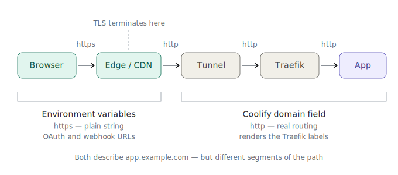

# Coolify: http vs https handling behind a tunnel

**Applies to:** any Coolify service or application published through a tunnel or CDN that terminates TLS at the edge (Cloudflare Tunnel, Zero Trust, or comparable).

**Symptom:** `ERR_TOO_MANY_REDIRECTS` / infinite `301` loop when the domain is set to `https://`. Works when set to `http://`, which feels wrong and gets "corrected" back to `https://` by the next person who touches it — reproducing the outage.

---

## 1. The confusion this document exists to kill

There are **two different places** where a scheme (`http://` / `https://`) gets written, and they mean opposite things:

| # | Where | Correct value behind a tunnel | What it actually is |
|---|---|---|---|
| 1 | Coolify **domain field** (service/app config) | `http://app.example.com` | **Configuration.** Coolify renders Traefik labels from it. Controls real packet behaviour. |
| 2 | App **environment variables** (e.g. `*_BASE_URL`, `WEBHOOK_URL`, `PUBLIC_URL`) | `https://app.example.com` | **A string.** The app pastes it in front of URLs it generates. Routes nothing. |

Both are correct at the same time. They describe **different segments of the same path.**

The failure mode is treating them as one setting. Someone sees `https://` in the env vars, concludes "so the domain field should be https too", changes it, and takes the service down. Or the reverse: sees `http://` in the domain field, "fixes" the env vars to match, and silently breaks OAuth.

---

## 2. The request path



TLS terminates at the edge. Everything to the right of it is plaintext, inside Docker networks, on the same host.

- **Env vars describe the first segment** — how the outside world reaches you. That is `https://`.
- **Domain field describes the last segment** — how the request arrives at Traefik. That is `http://`.

Neither is a lie. They're answering different questions.

---

## 3. Why `https://` in the domain field causes a loop

Set the domain field to `https://`, and Coolify renders a Traefik router on the `websecure` entrypoint plus a redirect middleware `web → websecure`.

Now trace it:

1. Edge receives the browser's HTTPS request, terminates TLS.
2. Tunnel daemon forwards it to Traefik as **HTTP**.
3. Traefik sees a plain HTTP request, applies the redirect: **`301 → https://app.example.com`**.
4. Edge follows the redirect, requests again.
5. Tunnel daemon forwards as **HTTP** again.
6. → step 3. Forever.

The tunnel can never satisfy the redirect, because sending HTTP *is what it does*. Traefik is asking for something the architecture cannot provide.

Set the domain field to `http://` and there is no redirect middleware. Traefik serves the HTTP request it was given. The browser still sees HTTPS, because TLS was handled at the edge — where it belongs.

**This is not "running without TLS".** Your traffic is encrypted from the browser to the edge. Past that it's on the loopback of a single host, inside Docker networks. Adding a second TLS layer there buys nothing and costs you an outage.

---

## 4. Why `https://` in the env vars is correct

The app never terminates TLS. Check for yourself:

```bash
docker exec <container> wget -qO- http://127.0.0.1:<PORT>/healthz
```

That's plain HTTP, from inside the container, and it works. There is no TLS listener. The env vars therefore cannot change how a request is served — there's nothing to change.

What they *do* control:

- **OAuth callback URLs.** The app sends this to the identity provider. Google and most providers reject `http://` callbacks outright. Must be `https://`.
- **Webhook URLs shown in the UI** for copy/paste into external systems. Those systems call you from the public internet — via the edge — so the URL must be `https://`.
- **Links in outbound emails**, if the app sends any.

It's string interpolation. Get it wrong and you get a wrong URL in an email, or a rejected OAuth handshake. You do **not** get a redirect loop, and you do **not** get a 504.

---

## 5. Reference config

```yaml
# Coolify domain field (UI, not compose):
#   http://app.example.com

services:
  app:
    image: 'vendor/app:1.2.3'
    environment:
      - 'APP_EDITOR_BASE_URL=https://app.example.com'
      - 'WEBHOOK_URL=https://app.example.com'
      - 'APP_HOST=app.example.com'
```

Note `APP_HOST` carries no scheme — it's a hostname, not a URL. Don't add one.

---

## 6. `*_PROTOCOL=https` — the one that can actually bite

Some apps expose a separate protocol variable (n8n: `N8N_PROTOCOL`). This one is not purely cosmetic. Depending on the app and version it may:

- feed into generated URLs (harmless, same as §4), **and**
- cause the app to set the `Secure` flag on session cookies.

A `Secure` cookie is not sent over plaintext HTTP. If the app is reached over HTTP internally and the browser's view of the connection doesn't line up, sessions can silently fail to persist — you log in, you get bounced back to the login screen, no error anywhere.

Most setups behind a tunnel work fine with `https` here, because the browser genuinely is on HTTPS and the edge sets `X-Forwarded-Proto: https`. Combined with a correct forwarded-headers config (`*_PROXY_HOPS` / `TRUST_PROXY`), the app sees the truth.

**Don't touch it if login works.** But if sessions start dropping for no visible reason, this is the first suspect — not the domain field, not the env URLs.

---

## 7. Diagnosis by symptom

| Symptom | Cause | Fix |
|---|---|---|
| `ERR_TOO_MANY_REDIRECTS` / 301 loop | Domain field is `https://` behind a tunnel | Domain field → `http://`, redeploy |
| OAuth provider rejects callback URL | Env `*_BASE_URL` is `http://` | Env → `https://`, redeploy, re-create the credential |
| Webhook URL shown as `http://` in UI | Env `WEBHOOK_URL` is `http://` | Env → `https://`, redeploy |
| Login works, then session drops | `Secure` cookie vs. proxy headers | See §6, check forwarded-proto / proxy-hops config |
| `504 Gateway Timeout` | **Not a scheme problem.** | See the multi-network / Traefik network-selection doc |

The last row matters. A `504` means the proxy found the route and couldn't reach the backend — a network-layer problem. Scheme misconfiguration produces redirect loops and broken URLs, never gateway timeouts. If you're chasing a `504` by flipping `http`/`https`, you are debugging the wrong layer and will burn hours.

---

## 8. Rules

1. Behind a tunnel: **domain field `http://`, env URLs `https://`.** Always. They are not supposed to match.
2. Changing the scheme requires a **redeploy**, not a restart — labels only re-render on deploy.
3. After changing an env `*_BASE_URL`, **re-create OAuth credentials**. The old ones hold a callback URL that no longer matches.
4. Before flipping any scheme, identify the symptom first. Loop → scheme. Timeout → network. They're never the same bug.
