# Azure Communication Services — Email SMTP Setup Guide

**Transactional Email with Custom Domain via Azure ACS**
Version 1.0 — April 2026

---

## Overview

This guide walks through the complete setup of Azure Communication Services (ACS) Email as an SMTP relay for transactional emails. The setup enables sending confirmation, password reset, and notification emails from a custom domain (e.g., `service@yourdomain.com`) through Microsoft's infrastructure.

This approach decouples transactional email delivery from your primary mailbox provider (e.g., Microsoft 365 Exchange Online) while using the same domain. Your regular mailboxes remain completely unaffected.

### Use Case

- Send transactional emails (confirmations, password resets, magic links) from a custom domain
- SMTP integration with Supabase Auth, n8n, or any SMTP-capable application
- Future-proof alternative to Microsoft 365 Basic Auth SMTP (deprecated April 2026)
- Cost-effective: ~$0.05/month for typical auth email volumes

### Prerequisites

- Azure account with an active subscription (Pay-as-you-go or Free Tier)
- DNS management access for your domain (e.g., Cloudflare, GoDaddy)
- An existing Microsoft 365 tenant (optional, but common in this scenario)

---

## Step 1 — Create a Resource Group

Create a dedicated resource group to isolate ACS email resources and enable clean cost tracking. Navigate to Azure Portal → Resource Groups → Create.

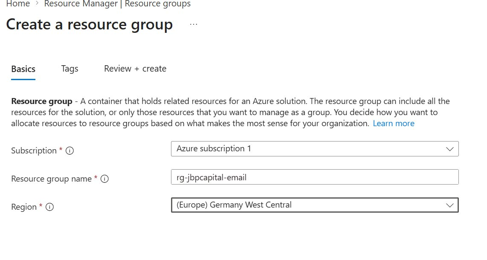
*Figure 1: Creating a dedicated resource group for ACS email resources*

> **Note:** Choose a region close to your users. The resource group region does not affect email delivery, but keeps your Azure resources organized geographically.

---

## Step 2 — Create Email Communication Service

Create the Email Communication Service resource. Navigate to Azure Portal → Create a resource → search for "Email Communication Services" → Create. Assign it to the resource group created in Step 1.

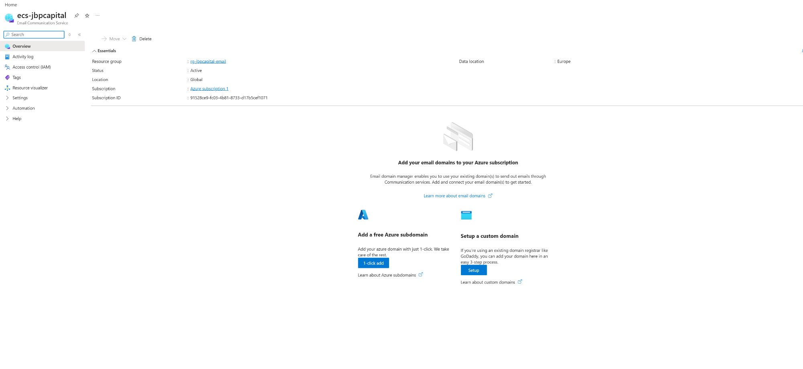
*Figure 2: Email Communication Service overview with domain setup options*

After creation, choose **"Setup a custom domain"** on the right side to begin domain verification. The free Azure subdomain on the left is suitable for testing only — it has very low sending limits.

---

## Step 3 — Verify Custom Domain

Azure requires domain ownership verification via a TXT record. Enter your domain name and Azure will provide the TXT record values to add to your DNS provider.

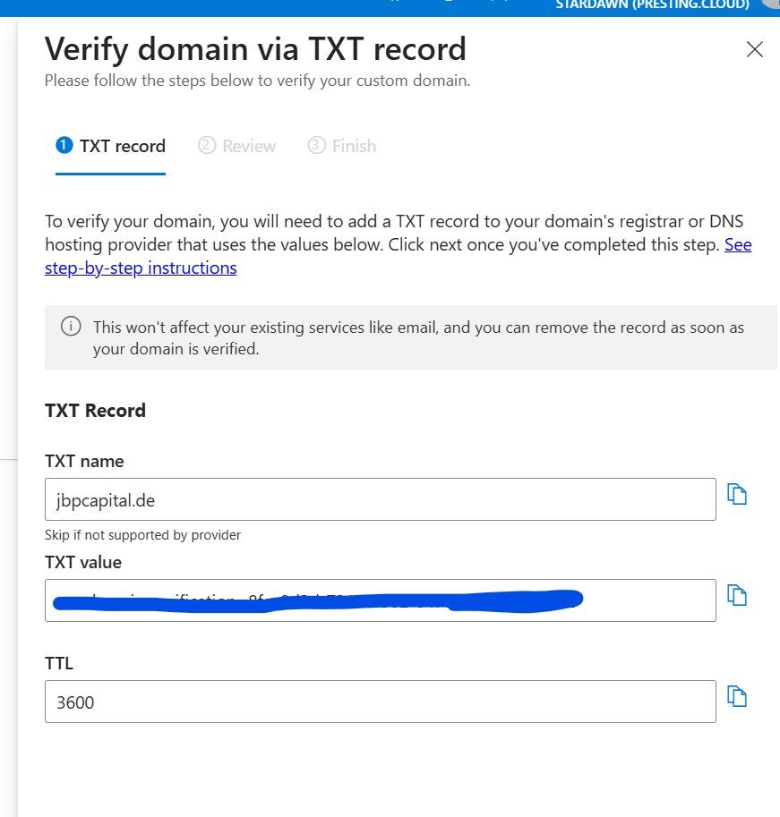
*Figure 3: Domain ownership verification via TXT record*

Add the TXT record to your DNS provider. Verification typically completes within 15–20 minutes.

### Domain Status After Verification

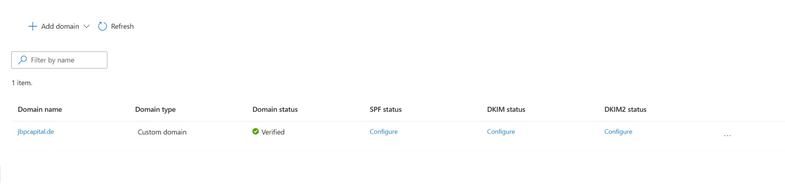
*Figure 4: Domain status showing Verified with SPF, DKIM, and DKIM2 pending configuration*

---

## Step 3b — Configure SPF and DKIM

After domain verification, Azure presents SPF and DKIM records that must be added to your DNS. This is critical for email deliverability and preventing messages from landing in spam.

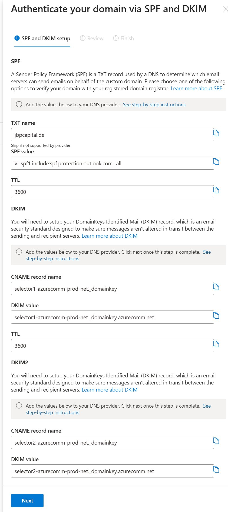
*Figure 5: SPF and DKIM configuration values provided by Azure*

**SPF Record (TXT):**

If you already have an existing SPF record (e.g., for Microsoft 365), extend it rather than creating a new one. Multiple SPF records on the same domain will break email delivery.

```
v=spf1 include:spf.protection.outlook.com include:azurecomm.net -all
```

> **Important:** The `-all` (hard fail) suffix is required. Azure Communication Services will reject SPF records with `~all` (soft fail).

**DKIM Records (2x CNAME):**

Create two CNAME records as shown by Azure. These must be set to **DNS-only** (no proxy) if using Cloudflare.

### All Records Verified

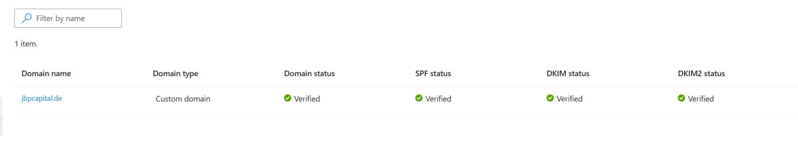
*Figure 6: All domain verification checks passed — Domain, SPF, DKIM, and DKIM2*

---

## Step 4 — Configure MailFrom Address

By default, Azure creates a `DoNotReply@yourdomain.com` sender. To add custom sender addresses (e.g., `service@` or `noreply@`), you may need to use the Azure CLI, as the portal Add button can be greyed out on default sending limits.

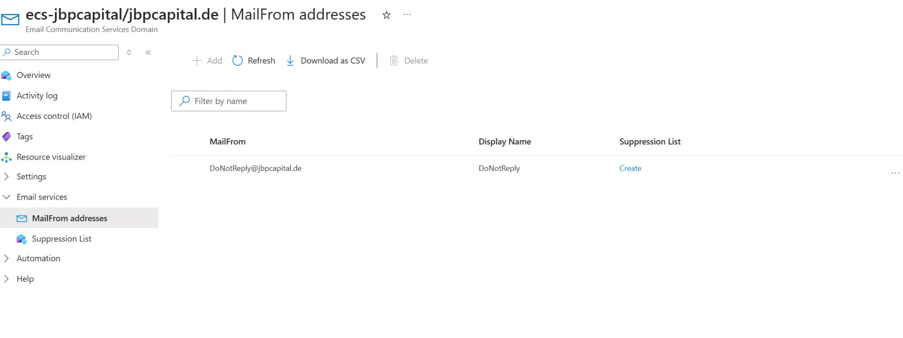
*Figure 7: Default MailFrom address created by Azure*

**Adding a custom sender via Azure CLI:**

```bash
az communication email domain sender-username create \
  --domain-name "yourdomain.com" \
  --email-service-name "your-ecs-name" \
  --resource-group "your-resource-group" \
  --sender-username "service" \
  --username "service" \
  --display-name "Your Service Display Name"
```

> **Note:** This is a known Azure portal limitation. The CLI workaround reliably creates additional MailFrom addresses without requiring a quota increase request.

---

## Step 5 — Create Communication Services Resource

Create a separate **Communication Services** resource (not the Email one). This is the main ACS resource that your applications will authenticate against. Navigate to Azure Portal → Create a resource → search "Communication Services".

---

## Step 6 — Connect Email Domain

After creating the Communication Services resource, connect the verified email domain from Step 3.

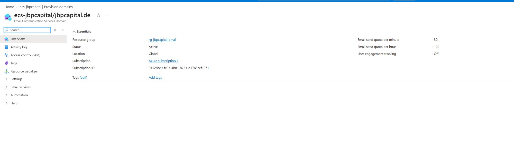
*Figure 8: Connecting the verified email domain to the Communication Services resource*

Select your subscription, resource group, email service, and the verified domain. Click Connect.

---

## Step 7 — Register Entra ID Application

ACS SMTP authentication requires a Microsoft Entra ID (formerly Azure AD) application. This acts as the service principal for SMTP authentication. Navigate to Microsoft Entra ID → App registrations → New registration.

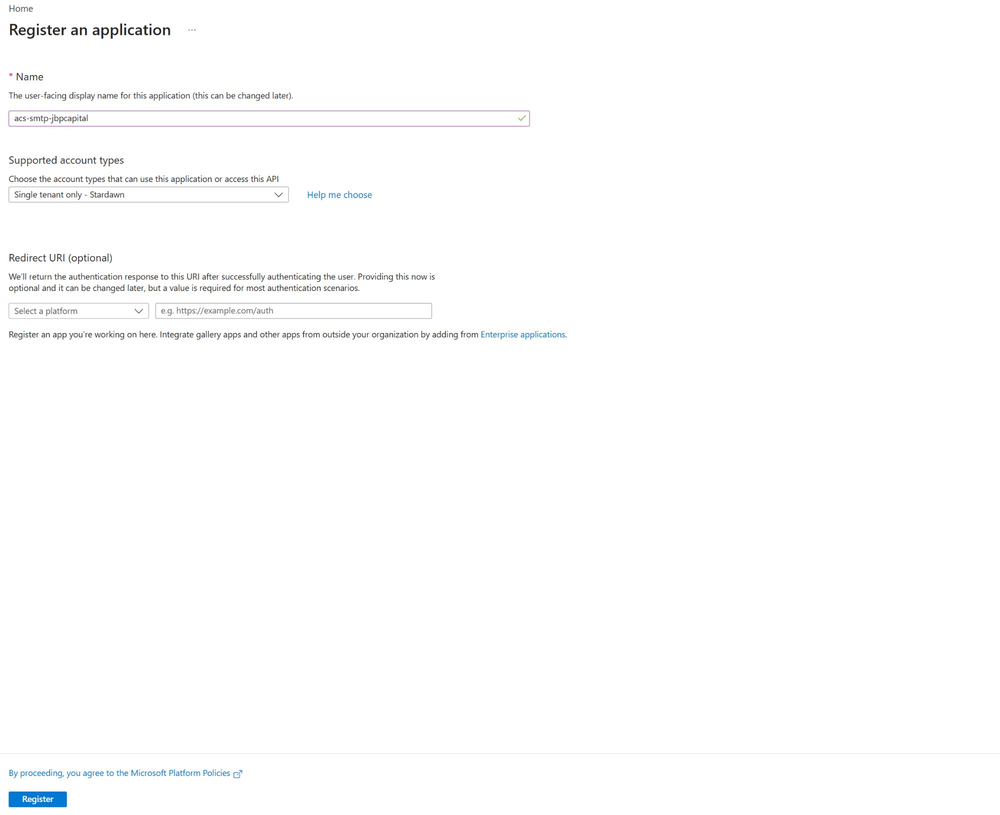
*Figure 9: Registering a new Entra ID application for SMTP authentication*

Set the account type to **Single Tenant**. No redirect URI is needed. After registration, note the **Application (client) ID** and **Directory (tenant) ID** from the overview page.

**Create a Client Secret:**

Navigate to Certificates & Secrets → Client secrets → New client secret. Set expiry to 24 months (maximum). Copy the secret value immediately — it is only shown once.

> **Important:** Set a calendar reminder to rotate the client secret before expiry. When the secret expires, transactional emails will stop sending until updated.

---

## Step 8 — Assign Role to Application

The Entra ID application needs the **"Communication and Email Service Owner"** role on the Communication Services resource. Navigate to the ACS resource → Access control (IAM) → Add role assignment.

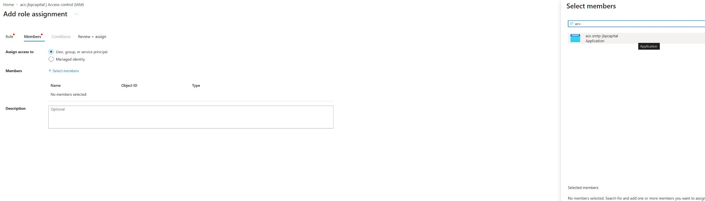
*Figure 10: Selecting the Entra ID application as a member for the role assignment*

Search for your application by name in the member selection panel. It will appear with the type "Application".

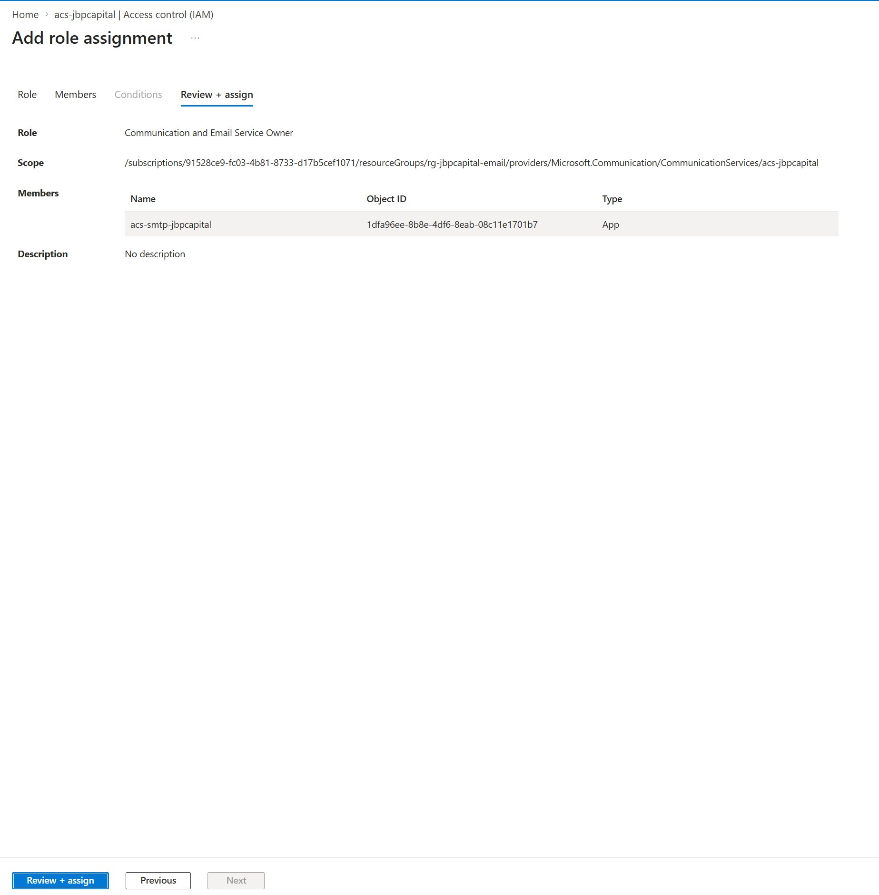
*Figure 11: Reviewing the role assignment before confirming*

---

## Step 9 — Create SMTP Username

In the Communication Services resource, navigate to **SMTP Usernames** and create a new entry. This maps an SMTP username to your Entra ID application for authentication.

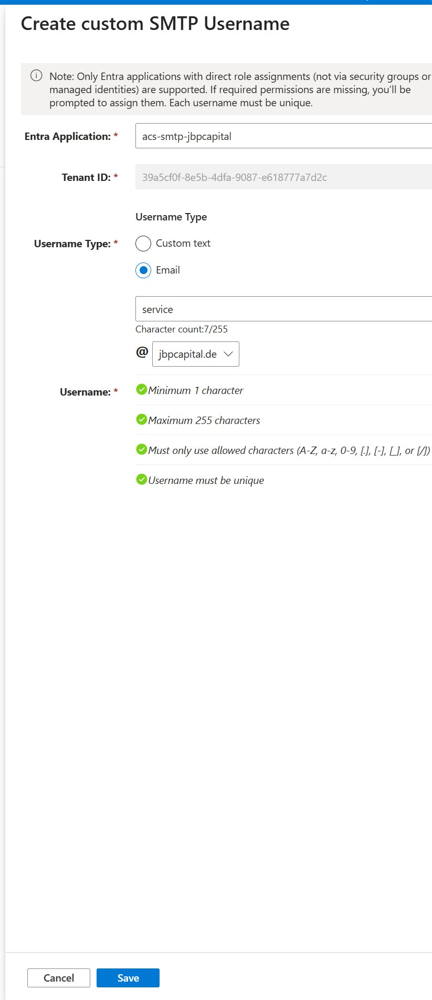
*Figure 12: Creating a custom SMTP username linked to the Entra ID application*

Select **"Email"** as the username type and enter the local part of your sender address (e.g., "service"). The domain dropdown will show your connected verified domain.

> **Note:** Using a custom SMTP username avoids the extremely long default format (`resource-name|app-id|tenant-id`) which can exceed character limits in many SMTP clients.

---

## Step 10 — Configure SMTP in Your Application

With all Azure components in place, configure your application's SMTP settings. The following values apply to any SMTP-capable application (Supabase, n8n, WordPress, custom apps, etc.):

```env
SMTP_HOST=smtp.azurecomm.net
SMTP_PORT=587
SMTP_USER=service@yourdomain.com
SMTP_PASS=<Entra App Client Secret>
SMTP_SENDER_NAME=Your Service Name
SMTP_ADMIN_EMAIL=service@yourdomain.com
```

After applying the configuration, restart your application's email/auth service and send a test email.

### Result

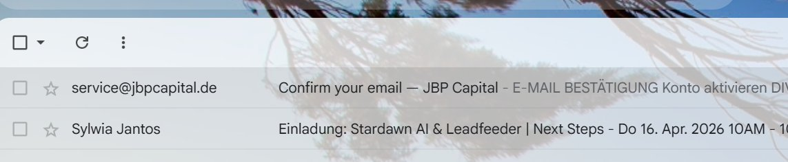
*Figure 13: Confirmation email successfully delivered from the custom domain*

The email arrives from the configured sender address with valid SPF and DKIM authentication, ensuring high deliverability and professional appearance.

---

## Step 11 — Set Up Budget Alerts

As a safety measure, configure a budget alert to monitor ACS email costs. Navigate to Cost Management + Billing → Budgets → Add.

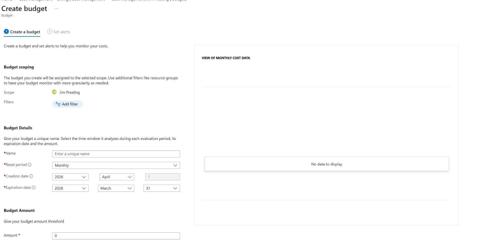
*Figure 14: Configuring a monthly budget with alert thresholds*

Set a reasonable monthly budget (e.g., $5) scoped to your ACS resource group. Configure alerts at 80% and 100% thresholds to receive email notifications if costs increase unexpectedly.

---

## Pricing Reference

| Component | Cost |
|-----------|------|
| Per email sent | $0.00025 |
| Per MB data transfer | $0.00012 |
| **Typical monthly cost (~100 auth emails)** | **< $0.05** |

---

## Maintenance & Lifecycle

| Task | Frequency |
|------|-----------|
| Rotate Entra App Client Secret | Every 24 months (set reminder!) |
| Review SPF record on domain changes | When adding new email services |
| Monitor Azure cost alerts | Monthly (automated via budget alerts) |

---

## Why Azure Communication Services?

Microsoft is retiring Basic Authentication for SMTP AUTH in Exchange Online by April 30, 2026. This means traditional SMTP setups using username/password (including App Passwords) will stop working. ACS provides a modern, OAuth-based SMTP relay that is fully supported going forward.

Key advantages over alternatives:

- Same Microsoft ecosystem as your M365 tenant — single billing, single identity provider
- Your primary mailbox (e.g., user@yourdomain.com on Exchange Online) remains completely unaffected
- Pay-as-you-go pricing with no monthly minimums
- Full SPF, DKIM, and DMARC compliance out of the box
- Scales from single auth emails to millions per hour

---

## References

- [Create Email Communication Service](https://learn.microsoft.com/en-us/azure/communication-services/quickstarts/email/create-email-communication-resource)
- [Add Custom Verified Domains](https://learn.microsoft.com/en-us/azure/communication-services/quickstarts/email/add-custom-verified-domains)
- [SMTP Authentication Setup](https://learn.microsoft.com/en-us/azure/communication-services/quickstarts/email/send-email-smtp/smtp-authentication)
- [Send Email via SMTP](https://learn.microsoft.com/en-us/azure/communication-services/quickstarts/email/send-email-smtp/send-email-smtp)
- [Getting Started with Email in ACS (Video Series)](https://techcommunity.microsoft.com/blog/azurecommunicationservicesblog/getting-started-with-email-in-azure-communication-services/4415640)
- [Exchange Online SMTP AUTH Deprecation Timeline](https://techcommunity.microsoft.com/blog/exchange/exchange-online-to-retire-basic-auth-for-client-submission-smtp-auth/4114750)
